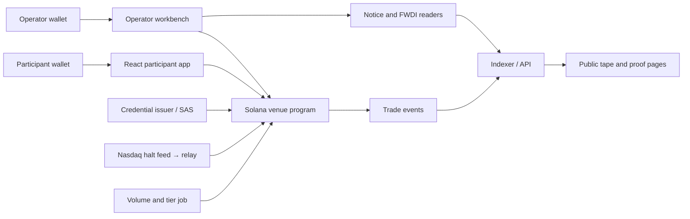

# Bellwether

Bellwether is a Solana venue-program prototype and operator workbench for the SEC's [Tokenized Securities Venue Innovation Exemption (Release 34-106402)](https://www.sec.gov/files/rules/exorders/2026/34-106402.pdf). It demonstrates permissioned rehearsal-stock swaps, exchange-halt and stale-feed stops, share budgets, listing clocks, and a public trade tape.

**Status:** A BWRS/test-USDC swap and tape read-back were proven end to end on devnet. A local Surfpool mainnet fork exercised the program against the real FWDI mint. Mainnet trading and public web hosting require separate verification. Bellwether is not an operating securities venue.

## Quick start

From a clone with Node.js ≥22, pnpm, Rust/Solana SBF tools and Surfpool installed:

```bash
npm install
pnpm -C web install
npm run typecheck
npx tsx checks/fork-scenario.ts
```

The fork scenario binds Surfpool to localhost, forks mainnet state, tests FWDI and time-dependent rules, and writes local proof to `scripts/fork/out/fork-scenario.json`. It needs a working mainnet RPC and may require locally configured Solana tooling. See [deployment and local services](scripts/deploy/README.md) for the full fork, devnet and service commands. Do not run the mainnet execution command as part of this quick start.

## How it works



The program's swap path checks credential → halt and heartbeat freshness → activation and pause → share budget → price and slippage → transfers → event. It rejects direct program calls that fail those checks. The halt relay records its source and latency; a stale heartbeat blocks swaps. LP positions are non-transferable, and proportional withdrawal remains possible during a halt. See the [program contract](docs/program-contract.md) for accounts, instructions and error codes.

## Environments and proof

| Environment | Asset and proof | Limit |
| --- | --- | --- |
| Devnet | BWRS rehearsal token and **test USDC**. Program `88chqe41hw9uhqrUK6KfytQ7aZgEGJzcqszXGKJFWfuB`; [finalized example swap](https://solscan.io/tx/3opPyjqKMpd5ubVimz33BX2xH87gWUcXdW6X6wpsSb3NCopRiu7oU5UNkkocoZVmnmqyupPSwpVZ3yTtvYUtCC7P?cluster=devnet) appeared on `/tape`. Full signatures: [`devnet.json`](scripts/deploy/deployments/devnet.json). | Test assets and test admission. |
| Local mainnet fork | Real FWDI mint; local fork scenario checked an FWDI swap, issuer-notice window and second-breach pause. | Fork-only cheatcodes thawed and funded FWDI accounts; local signatures are not public mainnet proof. |
| Mainnet | **[PROGRAM ID AND VERIFIED TRANSACTIONS AFTER DEPLOYMENT]** | No mainnet execution is claimed here. |

FWDI is used for read-only issuer and authority rehearsal. The fork's account thaw stands in for action by FWDI's transfer agent. BWRS does not represent FWDI equity. Admission is a test credential and does not complete KYC or legal participant eligibility checks.

## Run the local app against devnet

First complete the devnet setup in the [deployment guide](scripts/deploy/README.md), including its generated public `devnet.web.json` and local service environment. Then start the services and web app:

```bash
npx tsx scripts/deploy/start-services.ts --cluster devnet
pnpm -C web dev
```

Copy `scripts/deploy/deployments/devnet.web.json` to `web/public/config.json` before opening the app locally. That file contains public addresses and local API URLs; it does not start the services. See [web configuration](web/README.md) for cluster overrides and wallet behavior. The web UI is under active build; verify each route before recording or linking it publicly.

## Source layout

| Path | Purpose |
| --- | --- |
| `programs/venue` | Rust/Pinocchio pool program |
| `services/relay`, `services/caps` | Halt and share-budget inputs |
| `services/credential` | Test admission and credential issuance |
| `services/indexer`, `services/api` | Public tape and venue data |
| `services/notice`, `services/rehearsal` | Notice draft and FWDI authority rehearsal |
| `scripts/fork`, `scripts/deploy`, `checks` | Fork, deployment, smoke and acceptance checks |
| `web` | Participant, operator and public web surfaces |

## Legal and operational limits

The [SEC order](https://www.sec.gov/files/rules/exorders/2026/34-106402.pdf) places obligations on the actual US venue operator, including public and issuer notices, participant controls, records, and limits across affiliated venues. This software cannot make its developer or user a qualifying TSV, supply legal rights to a token, or replace counsel's review. The share cap in this prototype is a conservative per-trade-date stop; the order's comparison is based on average daily share volume. The relay polls about once a minute, so a halt is not guaranteed to be simultaneous with the listing exchange.

## License

**MIT license intended.** Add and verify the root `LICENSE` file before publishing this README or describing the repository as MIT-licensed. No license file was present when this draft was prepared.
